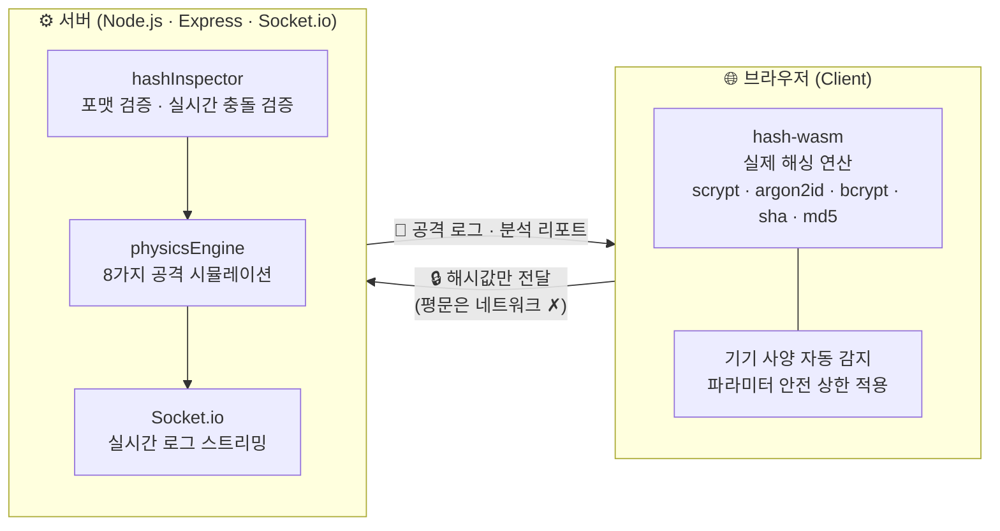
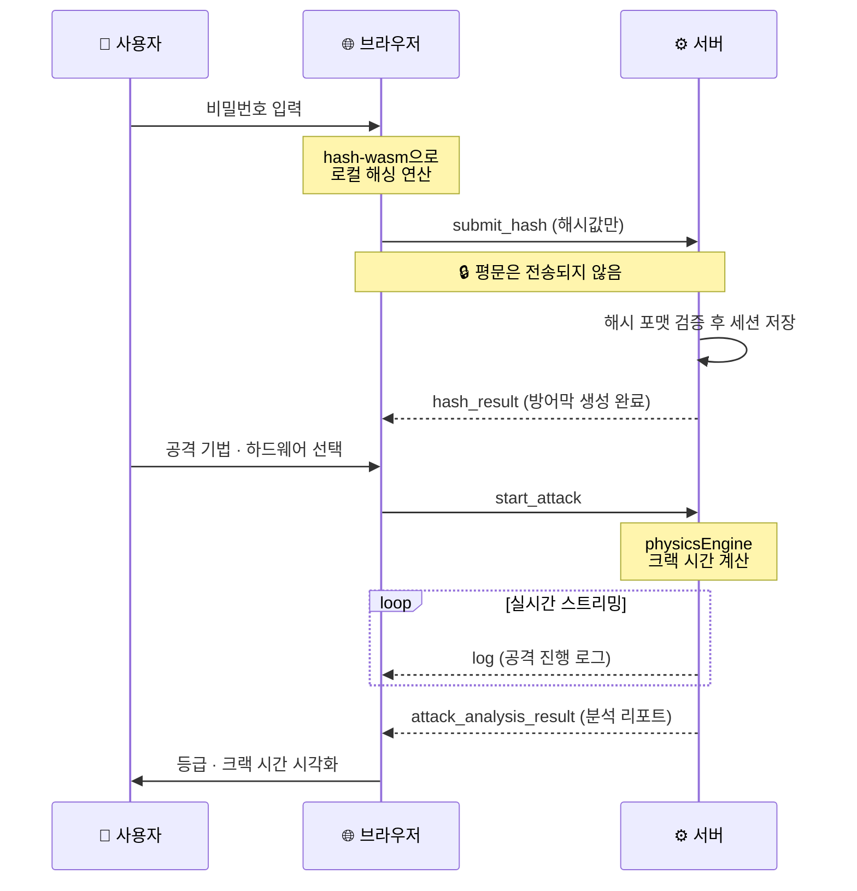
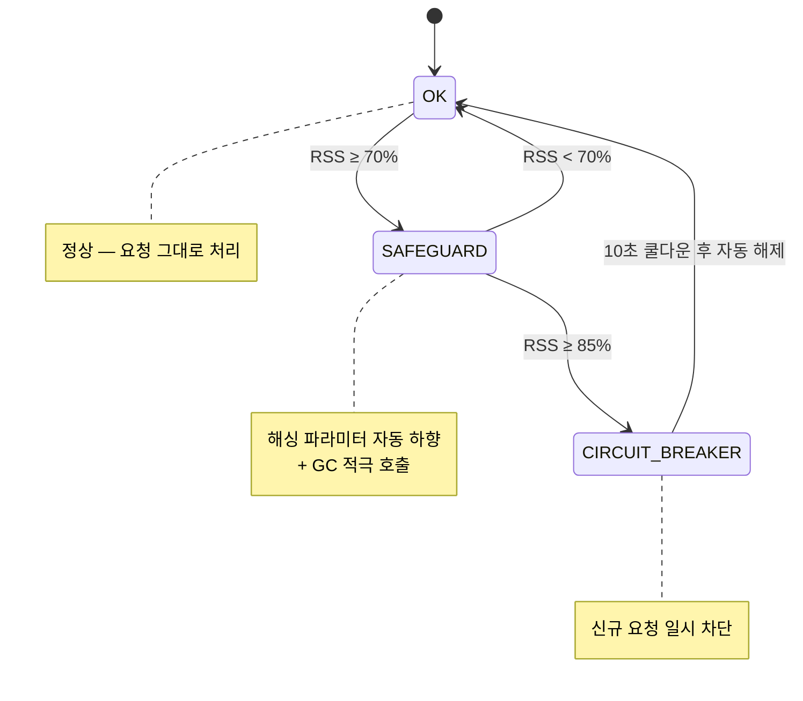
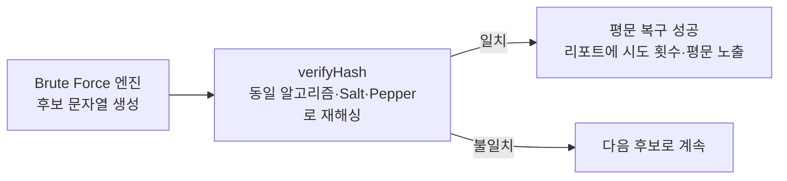

# 🛡️ ShieldBox.io: Real-time Password Security Simulator

> 📝 **이 프로젝트는 코드 구현·보안/아키텍처 검토·UI 제안·문서 작성 전반에 AI 도구를 적극 활용했습니다.**
> 다만 무엇을 만들지, 어떻게 풀지에 대한 최종 판단과 그 결과에 대한 책임은 모두 개발자가 직접 졌습니다.

추상적인 암호학 개념을 직접 체험할 수 있는 **인터랙티브 보안 교육 플랫폼**입니다.  
실제 해싱 알고리즘을 브라우저에서 직접 실행하고, 8가지 공격 시나리오 시뮬레이션을 통해 비밀번호 보안의 원리를 실시간으로 확인할 수 있습니다.

🔗 **[shieldbox-io.onrender.com](https://shieldbox-io.onrender.com)**

## 🎯 기술적 도전

이 프로젝트를 만들면서 실제로 부딪히고 고친 문제 세 가지입니다.

1. **Render 무료 플랜(512MB)에서 Argon2id·scrypt가 서버를 다운시킴** → 해싱 연산을 브라우저로 옮겨 서버 메모리와 분리 ([🔒 보안 설계](#-보안-설계))
2. **크랙 시간 계산에 쓰던 GPU 해시 속도 값이 최대 10배 틀려 있었음** → Hashcat 실측 벤치마크로 교정 ([🔬 physicsEngine 수치 검증](#-physicsengine-수치-검증))
3. **"짧은 비밀번호를 실제로 깨보는" 검증 기능이 개발 중 한 번도 작동한 적이 없었음** → Pepper 미전달·해시 포맷 불일치·서버 멈춤 위험까지 발견해서 수정 ([🔓 실시간 충돌 검증](#-실시간-충돌-검증))

## 📑 목차

1. [🎯 기술적 도전](#-기술적-도전)
2. [🏗️ 시스템 아키텍처](#️-시스템-아키텍처)
3. [🚀 핵심 기능](#-핵심-기능)
4. [🔒 보안 설계](#-보안-설계) ⭐
5. [🔬 physicsEngine 수치 검증](#-physicsengine-수치-검증) ⭐
6. [🔓 실시간 충돌 검증](#-실시간-충돌-검증) ⭐
7. [🛠️ 기술 스택](#️-기술-스택)
8. [📂 시작하기](#-시작하기)
9. [📁 프로젝트 구조](#-프로젝트-구조)
10. [📄 라이선스](#-라이선스)

---

## 🏗️ 시스템 아키텍처

본 프로젝트는 **Hybrid Client-Server 아키텍처**를 채택했습니다.



**핵심 설계 원칙**
- 해싱은 브라우저에서 — 서버 메모리 압박 없이 어떤 파라미터 조합도 처리 가능
- 평문 비밀번호는 네트워크를 타지 않음
- 공격 분석은 서버에서 — 탐색 공간 기반 수식으로 크랙 시간 추정

### 데이터 흐름

해싱부터 공격 분석까지의 전체 흐름입니다. **평문(Plaintext)은 브라우저를 벗어나지 않으며**, 서버로는 해시값만 전달됩니다.



> 참고: 공격 로그는 200ms 간격으로 한 줄씩 전송됩니다. 실제 분석(`engine.analyze()`)은 동기적으로 즉시 끝나며, 이 간격은 점진적으로 계산되는 과정을 보여주기 위한 것이 아니라 터미널처럼 로그가 흐르는 느낌을 주기 위한 의도적인 페이싱입니다.

---

## 🚀 핵심 기능

### 1. 🔐 실시간 해싱 파이프라인
브라우저에서 직접 6가지 알고리즘으로 해싱을 수행합니다.

| 알고리즘 | 등급 | 특징 |
|---------|------|------|
| Argon2id | S | NIST 권고. 메모리 하드 함수. GPU/ASIC 공격 구조적 무력화 |
| scrypt | S | N·r·p 파라미터로 메모리 비용 독립 조절. ASIC 공격에 강함 |
| bcrypt | A | Cost Factor 기반 적응형 해싱. 미래 하드웨어 발전에 유연하게 대응 |
| SHA-512 | B | 범용 해시. Salt 병행 필수 |
| SHA-256 | B | 인터넷 표준 해시. 단독 사용 시 취약 |
| MD5 | D | 충돌 저항성 붕괴. 레거시 용도로만 존재 (Salt 토글은 가능하나 알고리즘 자체의 충돌 취약성은 해소되지 않음) |

**파라미터 설정**
- memoryCost, timeCost, parallelism, blockSize, costFactor 등 알고리즘별 세부 조정
- Salt / Pepper 독립 제어 — 6자 이하 비밀번호는 [실시간 충돌 검증](#-실시간-충돌-검증)으로 직접 확인 가능
- 기기 사양 자동 감지 → 저사양 환경에서 파라미터 자동 하향 안내

### 2. ⚔️ 8가지 공격 시뮬레이션
탐색 공간·해시 속도 기반 수식(physicsEngine)으로 크랙 시간을 추정합니다.

| 공격 기법 | 설명 |
|---------|------|
| Brute Force | 94^n 전수 조사. Entropy 기반 소요 시간 산출 |
| Dictionary Attack | 96,000개 사전 패턴 매칭. 변형 규칙 포함 |
| Rainbow Table | Salt 유무에 따른 TMTO 리스크 진단 |
| Mask Attack | 비밀번호 구조 패턴 분석. 탐색 공간 압축률 계산 |
| Rule-Based | Leet Speak / Suffix 변형 패턴 역추적 |
| Side-Channel | 타이밍 공격 통계 모델링 (가우시안 확률 밀도) |
| Credential Stuffing | 다크웹 유출 DB 140억 건 기반 재사용 위험도 분석 |
| Collision Attack | Birthday Paradox 기반 충돌 저항성 검증 |

**하드웨어 옵션**: Single CPU / GPU Single / GPU Cluster / ASIC / Cloud Farm / Quantum

### 3. 📚 보안 아카데미
4개 섹션으로 구성된 인터랙티브 학습 콘텐츠

- **EntropyHub** — 비밀번호 엔트로피 분석 및 등급 산출 (F~S)
- **AlgorithmLibrary** — 알고리즘별 보안 강도 비교 및 상세 분석
- **AttackVectors** — 공격 기법 원리 설명 및 취약성 평가
- **ScenarioLab** — Salt / Pepper / Rainbow Table 시나리오 시각화

---

## 🔒 보안 설계

**왜 해싱 엔진을 서버가 아닌 브라우저에서 실행하나요?**

초기 설계는 서버(Node.js)에서 직접 해싱을 수행하는 구조였습니다. 그러나 실제 배포 환경에서 두 가지 문제가 발견됐습니다.

첫째, **메모리 한계**입니다. scrypt와 argon2id는 설계상 메모리를 대량 소비합니다. 예를 들어 scrypt를 `memoryCost=256MB, blockSize=32, parallelism=8`로 설정하면 실제 연산에 수 GB의 메모리가 필요합니다. Render 무료 플랜(512MB RAM)에서는 파라미터를 극도로 제한하거나 서버가 다운되는 문제가 반복됐습니다.

둘째, **파라미터 제한이 시뮬레이션 정확도를 저해**합니다. 서버 메모리를 보호하기 위해 사용자의 파라미터를 강제로 낮추면, ShieldBox의 핵심 목적인 "내가 설정한 값이 실제로 얼마나 안전한지 체험"이 불가능해집니다.

해결책은 연산 주체를 바꾸는 것이었습니다. 브라우저는 사용자의 로컬 RAM을 사용하므로 서버 메모리와 무관합니다. `hash-wasm` 라이브러리는 동일한 알고리즘의 C 레퍼런스 구현을 WebAssembly로 컴파일한 것이라 서버 측 결과와 수학적으로 동일합니다. 덕분에 어떤 파라미터 조합을 설정해도 서버가 죽지 않으며, 시뮬레이션 정확도도 그대로 유지됩니다.

**평문 보호**
- 해싱은 브라우저(hash-wasm)에서 수행 — 평문이 서버로 전송되지 않음
- 서버는 해시값의 포맷과 파라미터 일관성만 검증

**서버 보호 (Shield Guard)**

RSS 메모리 사용률에 따라 3단계로 서버를 보호합니다. 무료 호스팅(512MB)에서도 안정적으로 동작하도록 설계했습니다.



- **메모리 세이프가드**: RSS 70% 초과 시 파라미터 자동 하향
- **서킷 브레이커**: RSS 85% 초과 시 요청 차단 (10초 후 자동 해제)
- **Rate Limit**: 공격 시뮬레이션 5회/분, 해싱 20회/분 (IP별)

**가정과 대응**

위 가드들은 막연한 "방어"가 아니라 구체적인 악용 시나리오를 가정하고 만들었습니다.

| 가정 | 대응 |
|------|------|
| 한 사용자가 무거운 파라미터(예: argon2id 512MB)로 짧은 시간에 여러 번 해싱·공격 요청을 보낼 수 있다 | IP별 Rate Limit (해싱 20회/분, 공격 5회/분) |
| 다수의 무거운 요청이 동시에 몰려 서버 메모리가 고갈될 수 있다 | RSS 기반 3단계 가드 — 70%에서 파라미터 하향, 85%에서 신규 요청 차단 |
| 실시간 크랙 검증 기능(아래) 자체가 무거운 알고리즘으로 악용되어 이벤트 루프를 막을 수 있다 | 알고리즘별 연산 비용에 반비례하는 시도 횟수 상한 ([🔓 실시간 충돌 검증](#-실시간-충돌-검증) 참고) |

**환경 변수 분리**
- `.env` gitignore 처리

---

## 🔬 physicsEngine 수치 검증

먼저 이름에 대한 정정: `physicsEngine`은 실제 물리 시뮬레이션이 아니라 **탐색 공간(94ⁿ) ÷ 해시 속도 × 알고리즘별 work factor**로 크랙 시간을 추정하는 계산기입니다. 이름은 비유고, 이 섹션에서 한 일도 "독립적인 정확도 검증"이 아니라 **잘못 설정돼 있던 해시 속도 테이블을 Hashcat 공개 수치로 교정한 과정**입니다.

### 발견한 문제

`server/debug-tester.js`로 physicsEngine이 쓰는 `hashRates` 값을 **Hashcat v6.2.6 RTX 4090 공개 벤치마크** ([Chick3nman, 2022](https://gist.github.com/Chick3nman/32e662a5bb63bc4f51b847bb422222fd))와 대조해보니, 두 가지가 잘못돼 있었습니다.

| 문제 | 내용 | 영향 |
|------|------|------|
| 하드웨어 미분리 | `gpu_single`(RTX 4090 × 1)과 `gpu_cluster`(× 8)가 동일한 `rates.gpu` 단일값 사용 | Single과 Cluster 선택 시 동일한 크랙 시간 출력 |
| 속도값 부정확 | MD5: 16.4 GH/s로 설정돼 있었지만 Hashcat 실측은 164.1 GH/s(10배), scrypt도 약 7배 차이 등 | 일부 알고리즘을 실제보다 훨씬 안전하게(느리게 깨지는 것처럼) 평가 |

```bash
node server/debug-tester.js   # 알고리즘·하드웨어별 ShieldBox 추정값과 Hashcat 수치를 나란히 출력
```

### 고친 내용과 그 의미

`hashRates`를 하드웨어별로 분리하고 Hashcat 실측값으로 교체한 뒤, `physicsEngine.js`의 속도 매핑도 `hardware` 키를 직접 참조하도록 바꿨습니다. 그 결과 ShieldBox의 추정치와 "Hashcat 수치를 그대로 넣고 같은 공식으로 계산한 값"이 5개 알고리즘(MD5·SHA-256·SHA-512·bcrypt·scrypt) 전 하드웨어 조합에서 일치합니다 — 다만 이건 같은 rate를 같은 수식에 넣었으니 당연한 결과이고, 진짜 의미는 **"이전에는 틀린 rate를 쓰고 있었다"는 사실**입니다.

> **argon2id**: Hashcat 공개 벤치마크에 GPU 크래킹 데이터가 없어 비교 자체가 불가능합니다. 현행 추정값을 그대로 쓰고 있습니다.

<details>
<summary>📊 <b>자세히 보기 — 교정 전/후 수치, 하드웨어 티어별 산출 근거, Quantum을 교정하지 않은 이유</b></summary>

#### 교정 전/후 비교

| 알고리즘 | 항목 | v1 (구) | v2 (교정) | 출처 |
|---------|------|---------|----------|------|
| MD5 | GPU Single | 16.4 GH/s | **164.1 GH/s** | Hashcat Mode 0 실측 |
| MD5 | GPU Cluster | 16.4 GH/s | **1.31 TH/s** | × 8 선형 스케일 |
| SHA-256 | GPU Single | 3.5 GH/s | **21.97 GH/s** | Hashcat Mode 1400 실측 |
| SHA-512 | GPU Single | 3.5 GH/s | **7.48 GH/s** | Hashcat Mode 1700 실측 |
| bcrypt CF=12 | GPU Single | 5,000 H/s | **1,437 H/s** | Hashcat Mode 3200 (CF=5: 184kH/s ÷ 2⁷) |
| scrypt 32MB | GPU Single | 500 H/s | **3,563 H/s** | Hashcat Mode 8900 (N=16384: 7,126 ÷ 2) |

`physicsEngine.js`의 하드웨어 속도 매핑도 함께 바꿨습니다.

```js
// v1: 모든 GPU 계열을 단일 rates.gpu로 처리 (Single과 Cluster가 같은 값이 됨)
const hwRate = hardware.includes('gpu') ? rates.gpu : rates.pc;

// v2: hardware key를 rates 객체에서 직접 참조
const hwRate = rates[hardware] ?? (hardware.includes('gpu') ? rates.gpu_single : rates.pc);
```

#### 교정 후 수치

기준: 11자 비밀번호(`password123`), 탐색 공간 94¹¹. "Hashcat 수치 대입"은 Hashcat이 측정한 해시 속도를 physicsEngine과 동일한 수식에 그대로 넣은 값입니다 — 같은 rate로 같은 공식을 두 번 돌린 것이므로 일치하는 게 당연하지만, v1에서는 rate 자체가 틀려서 이마저도 안 맞았습니다.

| 알고리즘 | 하드웨어 | ShieldBox 추정 | Hashcat 수치 대입 | 배율 |
|---------|---------|--------------|----------------|------|
| MD5 | GPU Single (RTX 4090) | 25.71분 | 25.71분 | 1.00x |
| MD5 | GPU Cluster (× 8) | 3.21분 | 3.21분 | 1.00x |
| SHA-256 | GPU Single | 3,650년 | 3,650년 | 1.00x |
| SHA-256 | GPU Cluster | 456년 | 456년 | 1.00x |
| SHA-512 | GPU Single | 1.07만년 | 1.07만년 | 1.00x |
| bcrypt CF=12 | GPU Single | 558억년 | 558억년 | 1.00x |
| bcrypt CF=12 | GPU Cluster | 69.75억년 | 69.73억년 | 1.00x |
| scrypt 32MB | GPU Single | 225억년 | 225억년 | 1.00x |
| scrypt 32MB | GPU Cluster | 28.15억년 | 28.14억년 | 1.00x |

#### 하드웨어 티어별 산출 근거

6개 하드웨어 옵션 중 실제로 Hashcat 실측값에 기반한 건 GPU Single/Cluster뿐입니다. 나머지는 명시적인 근거를 두고 파생하거나 추정했습니다.

| 하드웨어 | 산출 근거 | 분류 |
|---------|---------|------|
| GPU Single (RTX 4090) | Hashcat v6.2.6 실측 벤치마크 | 실측 |
| GPU Cluster (8× RTX 4090) | GPU Single × 8 (선형 스케일) | 실측 기반 스케일 |
| Cloud Farm (AWS p4d.24xl) | 8× A100 ≈ GPU 클러스터 동급으로 매핑 | 추정(파생) |
| ASIC Rig | 빠른 해시(MD5/SHA): GPU 클러스터 × 2.3 / 메모리 하드(bcrypt·scrypt·argon2id): ASIC 이점 없어 클러스터와 동일 | 추정(파생) |
| Single CPU (Ryzen 9 7950X) | 알고리즘별 CPU 단일 코어 추정치 (Hashcat CPU 벤치마크 미반영) | 추정 |
| Quantum (이론) | 이론적 상한 상수 — 아래 참조 | 이론적 가정 |

**ASIC가 메모리 하드 함수에 이점이 없는 이유**: bcrypt·scrypt·argon2id는 설계상 대량의 메모리 대역폭을 요구하므로, 연산 회로를 특화해도 메모리 병목이 그대로 남습니다. ASIC의 강점은 연산이 단순한 MD5/SHA 계열에만 적용됩니다.

#### Quantum 하드웨어를 교정하지 않은 이유

CPU·GPU 속도는 Hashcat이라는 실측 기준이 있어서 교정할 수 있었습니다. 양자 컴퓨터의 해시 크래킹 벤치마크는 존재하지 않으므로, 어떤 수치를 넣어도 그건 추측입니다.

Grover 알고리즘을 적용하면 탐색 공간을 제곱근으로 줄일 수 있습니다(94¹¹ ≈ 2⁷² → 2³⁶). 하지만 실제 크랙 시간을 계산하려면 결국 양자 게이트의 처리 속도라는 상수가 필요한데, 이 값은 학계에서도 추정이 크게 엇갈립니다. √N 공식을 적용해도 그 안의 게이트 속도는 여전히 임의의 추측값이라서, 결과적으로 정밀한 수학으로 포장된 추측이 됩니다.

게다가 ShieldBox가 권장하는 메모리 하드 함수(argon2id, scrypt)는 Grover 오라클을 구성하는 것 자체가 비현실적이라고 평가됩니다. 단순하게 √N만 적용하면 가장 안전한 알고리즘들의 위협을 과장하게 됩니다.

그래서 Quantum 값은 calibration된 실측값이 아니라, "이론적 미래 하드웨어에서도 강력한 암호는 즉시 뚫리지 않는다"는 방향성을 전달하는 교육용 상한 지표로 남겨뒀습니다. UI에도 `(이론)` 라벨을 붙여 calibration된 다른 하드웨어와 구분했습니다.

</details>

---

## 🔓 실시간 충돌 검증

physicsEngine이 "이론적으로 몇 년 걸린다"를 계산하는 영역이라면, 이 기능은 그 반대편에 있습니다. **6자 이하의 짧은 비밀번호(MD5·SHA-256·SHA-512)에 대해 서버가 실제로 전수 대입을 수행해서 평문을 복구하는지 실증**합니다. 추정이 아니라 직접 돌려본 결과입니다.

### 동작 방식

`server/core_logic/hashInspector.js`의 `verifyHash`가 브라우저(`useHashEngine.js`)와 **동일한 알고리즘·Salt·Pepper**로 후보 문자열을 재해싱해서 제출된 해시와 비교합니다. `Brute Force` 공격 시 후보를 `a, b, ..., aa, ab, ...` 순으로 늘려가며 일치하는 순간 평문을 실제로 복구해서 리포트에 표시합니다.



### 개발 중 발견하고 교정한 문제

검증 코드를 직접 `socket.io` 클라이언트로 호출해보는 과정에서, 이 기능이 **개발된 이후 한 번도 정상 동작한 적이 없었다는 것**을 발견했습니다.

- 클라이언트가 만드는 해시 포맷과 서버가 가정한 포맷이 달라서, 비밀번호 길이·내용과 무관하게 평문 복구가 **항상 실패**
- 클라이언트가 해싱에는 Pepper를 쓰지만, 서버로 보내는 설정 객체에서는 Pepper 값이 빈 문자열로 지워져서 검증이 원천적으로 불가능
- Salt 문자열을 반복 횟수로 잘못 해석하면 거대한 수가 들어가, **단일 요청이 서버 전체를 멈출 수 있는** 가용성 문제까지 발견 (다른 클라이언트 503 재현됨)

세 가지를 모두 고친 뒤 직접 호출해서 재검증했고, Pepper가 일치할 때만 평문이 복구되는 것까지 확인했습니다.

<details>
<summary>🐛 <b>디버깅 과정 자세히 보기 — 문제 표, 재검증 결과, 가용성 가드</b></summary>

| 문제 | 내용 | 영향 |
|------|------|------|
| 해시 포맷 불일치 | `verifyHash`가 `algo$i=N$s=salt$digest`(PBKDF2 기반) 포맷을 가정했지만, 클라이언트는 실제로 `algo$salt$digest` 3등분 포맷에 자체 반복 체이닝을 사용 | 길이·내용과 무관하게 평문 복구가 **항상 실패** |
| Pepper 미전달 | 클라이언트가 해싱에는 Pepper를 사용하지만, 서버로 보내는 설정 객체에서 Pepper 값을 빈 문자열로 지움 | 서버가 Pepper를 알 수 없어 검증이 원천적으로 불가능 |
| 동기 연산 폭주 위험 | Salt 문자열을 반복 횟수로 잘못 해석해 `pbkdf2Sync`에 거대한 수가 들어가면, 최대 50만 회 후보 시도가 동기적으로 실행됨 | 단일 요청이 **서버 전체를 멈춤** (다른 클라이언트 503 재현됨) |

세 가지를 모두 고친 뒤 `socket.io` 클라이언트로 직접 호출해서 재검증했습니다.

| 시나리오 | 결과 |
|---------|------|
| MD5 + Pepper 일치 | `found: true`, 74회 시도 후 평문 복구, 리포트에 "🚪 열려 있는 종이 문" 전용 화면 표시 |
| MD5 + Pepper 불일치(다른 값) | `found: false` — Pepper가 실제로 검증 결과를 바꾼다는 증거 |
| SHA-256 + Pepper 일치 | `found: true`, 0.9초 내 완료 |

#### 가용성 가드

SHA-256/512는 해시 1회당 내부 반복(최대 1,000회)이 있어, MD5와 같은 시도 횟수(50만 회)를 그대로 적용하면 최대 5억 회의 연산이 동기적으로 실행될 수 있습니다. `maxAttempts = max(1000, floor(workBudget / loopCount))`로 알고리즘이 무거울수록 시도 횟수를 비례해서 줄여, 어떤 알고리즘을 골라도 서버가 멈추지 않도록 설계했습니다.

</details>

---

## 🛠️ 기술 스택

| 구분 | 기술 | 사용 목적 |
|------|------|---------|
| **Frontend** | React 19 + Vite | 컴포넌트 기반 UI |
| **Styling** | Tailwind CSS v4 | 라이트/다크 테마 디자인 시스템 |
| **Animation** | Framer Motion | 실시간 데이터 흐름 시각화 |
| **Hashing** | hash-wasm | 브라우저 WASM 기반 실제 해싱 연산 |
| **Real-time** | Socket.io | 공격 로그 실시간 스트리밍 |
| **Server** | Node.js + Express | 공격 시뮬레이션 엔진 / 정적 파일 서빙 |
| **배포** | Render (Free) | 서버 + 프론트 통합 배포 |

---

## 📂 시작하기

### 로컬 개발 환경

```bash
# 레포지토리 클론
git clone https://github.com/cjfwls39/ShieldBox.io.git
cd ShieldBox.io

# 환경 변수 설정
cp .env.example .env

# 서버 패키지 설치
npm install

# 클라이언트 패키지 설치
npm install --prefix client

# 서버 실행 (포트 4000)
npm run dev:server

# 클라이언트 실행 (포트 5173) — 별도 터미널
npm run dev:client
```

### 배포 빌드

```bash
# 프론트엔드 빌드 (client/dist/ 생성)
npm run build

# 서버 실행 (빌드된 프론트 포함 서빙)
npm start
```

### 환경 변수 (.env)

```
VITE_BACKEND_URL=http://localhost:4000   # 프론트엔드용
PORT=4000                                 # 서버 포트
FRONTEND_URL=http://localhost:5173        # CORS 허용 주소
```

---

## 📁 프로젝트 구조

```
ShieldBox.io/
├── .env                          # 통합 환경 변수 (gitignore)
├── .env.example                  # 환경 변수 템플릿
├── package.json                  # 루트 (서버용 commonjs)
├── client/                       # 프론트엔드 (Vite + React)
│   ├── package.json              # 클라이언트용 (module)
│   ├── src/
│   │   ├── hooks/
│   │   │   ├── useShieldEngine.js  # 소켓 + 상태 관리
│   │   │   └── useHashEngine.js    # hash-wasm 해싱 로직
│   │   ├── components/
│   │   └── constants/
│   └── vite.config.js
└── server/
    ├── server.js                 # 메인 서버 진입점
    ├── config/
    │   └── shield-config.js      # 전체 수치 중앙 관리
    ├── guards/
    │   └── memoryGuard.js        # 메모리 세이프가드
    ├── core_logic/               # 물리 엔진 / 판정 / 레지스트리
    ├── engines/attacks/          # 8가지 공격 엔진
    └── data/                     # 사전 / 리포트 템플릿
```

---

## 📄 라이선스

본 프로젝트는 **MIT License** 하에 배포됩니다.

- 아이디어, 설계, 기획 및 구현 방향 — 저작자 창작
- 코드 작성 과정에서 AI 도구(Claude by Anthropic) 활용
- 출처 표기 시 자유롭게 사용 가능

자세한 내용은 [LICENSE](./LICENSE) 파일을 참고하세요.